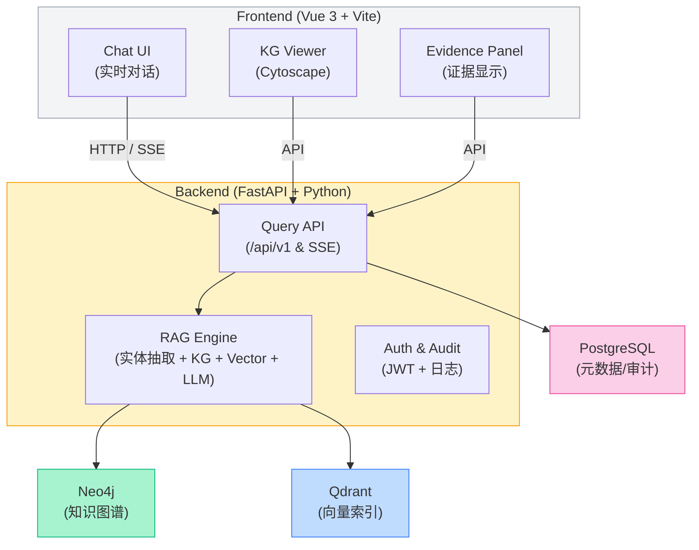

# 基于知识图谱的医疗问答系统 (Medical KG QA System)

[](https://opensource.org/licenses/MIT)
[](https://www.python.org/downloads/)
[](https://vuejs.org/)

一个基于知识图谱和大语言模型的医疗问答系统，支持自然语言问答、证据级参考、可视化知识浏览与分析报表。

## 🌟 功能特性

- **自然语言问答**: 用户可用自然语言提问医疗相关问题（症状、疾病、用药、指南解释等）
- **混合检索**: 知识图谱 + 向量检索的混合检索策略
- **证据溯源**: 所有回答均有来源引用（PubMed、临床指南、DrugBank 等）
- **知识图谱可视化**: 交互式节点/边浏览，支持路径高亮
- **置信度评分**: 显示可信度分数与医疗免责声明
- **响应式设计**: 支持桌面端和移动端，暗黑模式

## 🏗️ 技术架构

概览：系统采用前后端分离模式，后端以 FastAPI 提供结构化问答 API 与流式 SSE（Server-Sent Events），并通过混合检索（KG + 向量检索）结合 LLM 生成高质量、可溯源的医疗回答。

主要组件：

- 前端（Vue 3 + Vite）

  - Chat UI：主对话交互，支持流式显示、消息历史、撤回/重发等操作
  - KG Viewer：基于 Cytoscape 的知识图谱可视化（路径高亮、节点详情）
  - Evidence Panel：展示证据列表、文献片段、置信度与来源链接

- 后端（FastAPI + Python）

  - API/Router：暴露标准 REST 与流式接口（/api/v1/query, /api/v1/query/stream）
  - QAService（RAG 引擎）：负责实体抽取、KG 检索、向量检索、构建 LLM prompt 与 LLM 调用（支持 OpenAI / Gemini / SiliconFlow）
  - KG Service（Neo4j）：知识图谱查询与上下文构建（支持全文索引 `kg_fulltext`）
  - Vector Service（Qdrant 或 Mock）：文献/文档检索（用于证据检索）
  - Memory Service（SQLite）：短期持久记忆（按 user_id 存储问答摘录并检索）
  - Session Service（持久会话）：会话同步与跨设备恢复
  - Logging & Audit：日志（loguru）、审计记录与可选 DB 存储

- 数据存储
  - Neo4j：知识图谱主存储（Disease / Symptom / Drug / ...）
  - Qdrant（可选）：向量索引（文献/证据检索）
  - SQLite / PostgreSQL：记忆、会话或审计（按部署需要）

关键特性与实现要点：

- 混合检索（RAG）：先用 KG 做实体消解与上下文，再用向量检索补充文献证据，最终把 KG 内容 + 证据片段注入 LLM prompt（或在 KG-only 模式下使用模板化回答）。
- 流式输出：使用 SSE 将检索和生成状态逐步推送到前端，改善用户感知延迟。
- 可配置 LLM：根据 env（`.env`）选择 OpenAI / Gemini / SiliconFlow，平台中实现超时保护、线程池封装（阻塞 SDK）等兼容层。
- 可观测性：详细 debug 日志会记录实体抽取、证据检索的中间结果，有利于问题定位（参见 `docs/DEBUG.md`）。

（更多实现细节可参见 `docs/KG_query_flow.md` 与 `docs/DEBUG.md`）

---

### 架构图（可视化）

下面使用 Mermaid 格式展示系统架构（GitHub 支持 Mermaid）：



## 架构说明 ✅

下文简要说明架构中各组件的职责与关键交互。

- **Frontend（Vue 3 + Vite）**：提供 `Chat UI`、`KG Viewer`、`Evidence Panel` 等界面组件；负责收集用户消息、展示流式回复以及证据详情，向后端发起 HTTP / SSE 请求并渲染逐段返回的响应。
- **Backend（FastAPI + Python）**：暴露查询与流式 API（`/api/v1`），处理鉴权与审计，协调 RAG 引擎、会话与持久化服务，负责将 LLM 的生成流式推送回前端。
- **RAG Engine（检索-增强生成）**：负责对当前 query 做实体抽取、并行调用 Neo4j（知识图谱）与 Qdrant（向量索引）检索证据，合并最近上下文并构造 prompt 提交给 LLM，最终融合“证据段 + 回答”供前端展示。
- **Neo4j（知识图谱）**：提供基于实体的精确/全文/包含检索与关系扩展，用于构建结构化上下文与溯源证据。

#### 知识图谱数据源 📚

- 数据来源： [DiseaseKG: 基于 cnSchema 常见疾病信息知识图谱](http://data.openkg.cn/dataset/disease-information)
- 简介：DiseaseKG 提供结构化的常见疾病实体与关系，适合导入 Neo4j 作为主要的 KG 数据来源，用于实体匹配、关系检索与证据溯源。

- **Qdrant（向量索引）**：存储文本嵌入并支持相似度检索，作为补充证据来源以提升召回与回答准确性。
- **PostgreSQL / SQLite（元数据与会话）**：负责会话历史、短期记忆与审计日志的持久化存储（可配置为 PostgreSQL 或 SQLite）。
- **Auth & Audit**：JWT 鉴权、请求与证据访问审计、日志记录，确保合规与可追溯。
- **LLM（外部或托管模型）**：接收 RAG 构建的 prompt 并返回生成文本；系统设计支持流式返回（SSE）。

### 数据流（请求示例） 🔁

1. 用户在前端输入问题并发送；前端会收集最近 N 条消息（默认 12 条）并把当前消息通过 HTTP POST（或建立 SSE）发送到后端 `POST /api/v1/query`。
2. 后端验证请求并查找会话后，触发 RAG 流程处理该 query。
3. **实体抽取仅基于当前 query**（以避免将与本轮无关的历史证据混入本次检索）。
4. 使用抽取到的实体在 Neo4j 中优先按 `exact → fulltext → contains` 的顺序检索；同时以 query 为输入对 Qdrant 做向量检索以获取相似文本片段。
5. 将检索到的证据与最近上下文（后端默认使用最近 6 条消息）合并，构造 prompt 并调用 LLM 生成回答。
6. 后端以 SSE 或分块 HTTP 方式将生成的回答逐段发送到前端；同时将会话、证据片段索引与审计日志持久化到数据库。
7. 前端逐段渲染回答并在证据面板中展示检索来源，用户可展开查看或标注错误证据以改进系统。

### 关键设计点与注意事项 ⚠️

- **证据隔离**：检索使用当前 query 的实体提取，避免展示与本轮无关的历史证据，增强可解释性与安全性。
- **同义词与回退机制**：KG 检索内置 `SYNONYMS` 同义词映射与 n-gram 回退逻辑，以提升对口语/别名（例如“小儿麻痹症” → “脊髓灰质炎”）的召回能力。
- **流式体验**：使用 SSE 实现低延迟、分段流式响应，前端需支持重连与错误恢复策略。
- **安全与审计**：对敏感查询与证据访问进行审计与脱敏处理，确保合规性。

详见：`docs/KG_query_flow.md` 与 `docs/DEBUG.md`，里面有更详细的检索流程与调试步骤。

## 📁 项目结构

```
.
├── backend/                 # FastAPI 后端服务
│   ├── app/
│   │   ├── api/            # API 路由（/api/v1）
│   │   ├── core/           # 核心配置（settings, logging）
│   │   ├── models/         # Pydantic 数据模型（QueryRequest/QueryResponse 等）
│   │   ├── services/       # 业务实现（qa_service, kg_service, vector_service, memory_service, session_service）
│   │   └── utils/          # 工具函数与中间件
│   ├── data/               # 示例与测试数据
│   ├── tests/              # 单元/集成测试
│   └── requirements.txt
├── frontend/               # Vue 3 + Vite 前端应用
│   ├── src/
│   │   ├── components/     # 可复用组件（ChatMessage, EvidencePanel, SettingsModal）
│   │   ├── views/          # 页面视图（ChatView, GraphView, HomeView）
│   │   ├── stores/         # Pinia 状态管理（sessions, chat store）
│   │   └── services/       # 前端 API 客户端（queryAPI, sessionAPI）
│   ├── public/
│   └── package.json
├── diseasekg/              # 知识图谱构建脚本（medical.json -> Neo4j）
│   ├── data/               # 源数据（medical.json）
│   ├── dict/               # 词典与辅助文件
│   └── prepare_data/       # 抓取与清洗脚本
├── docs/                   # 文档（DEBUG.md, KG_query_flow.md, BUILD.md 等）
├── .gitignore
└── README.md
```

提示：更多关于 KG 构建流程与调试信息请参见 `docs/KG_query_flow.md` 与 `docs/DEBUG.md`。

## 🚀 快速开始

### 环境要求

- Python 3.11+
- Node.js 18+
- Neo4j 5.x

### 快速开始

#### 后端

```bash
cd backend

# 创建虚拟环境
conda create -n medical_chat python=3.11
conda activate medical_chat

# 安装依赖
pip install -r requirements.txt

# 构建知识图谱
python build_kg.py

# 配置环境变量
cp env.example.txt .env
# 编辑 .env 文件配置 API Key 和数据库连接

# 启动服务
uvicorn app.main:app --reload --host 0.0.0.0 --port 8000
```

#### 前端

```bash
cd frontend

# 安装依赖
npm install

# 启动开发服务器
npm run dev
```

## 📖 API 文档

启动后端服务后访问：

- Swagger UI: http://localhost:8000/docs
- ReDoc: http://localhost:8000/redoc

### 核心接口

#### POST /api/v1/query - 问答查询

```json
// 请求
{
  "query": "头痛两天，可能是什么原因？",
  "max_answers": 3,
  "include_kg_paths": true
}

// 响应
{
  "answer": "头痛可能由多种原因引起...",
  "evidence": [
    {
      "source": "PubMed",
      "snippet": "偏头痛是一种常见的原发性头痛...",
      "pmid": "12345678",
      "confidence": 0.93,
      "url": "https://pubmed.ncbi.nlm.nih.gov/12345678"
    }
  ],
  "kg_paths": [...],
  "warnings": ["本系统仅供参考，不能替代医生诊断"],
  "confidence_score": 0.89
}
```

## ⚠️ 免责声明

**重要提示**: 本系统为医疗信息检索及参考工具，**不能替代专业医生的诊断和治疗建议**。

- 所有临床建议仅供参考，需经专业医疗人员核实
- 紧急情况请立即就医或拨打急救电话
- 系统不存储或处理个人健康信息 (PHI)
- 使用本系统即表示您已理解并接受以上声明

## 📊 数据来源

本系统知识图谱数据来源于以下公开医学资源：
数据来源： [DiseaseKG: 基于 cnSchema 常见疾病信息知识图谱](http://data.openkg.cn/dataset/disease-information)

## 📧 联系方式

如有问题或建议，请联系1847539781@qq.com。
